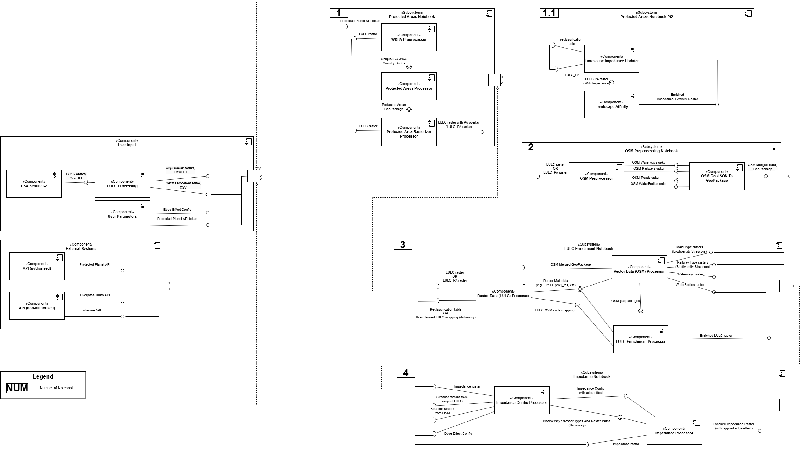

## **Data4Land** tool - enriching land-use/land-cover with historical vector data

Data4Land tool is developed to enrich various land-use/land-cover (LULC) spatial data with data from another sources to increase the consistency and reliability of LULC datasets for multiple purposes. This software currently includes four separate Jupyter Notebooks:

1. **[Access to historical data from the World Database on Protected Areas (WDPA) and harmonization](src/1_pas.ipynb)**

Available only through the authorised credentials (token), as it uses the special API.

2. **[Access and harmonisation of historical vector data on land-use/land-cover (LULC) - Open Street Map (OSM) data ](src/2_vector.ipynb)**

Available without authorised credentials, uses open-access API.

3. **[Enrichment of land-use/land-cover (LULC) data](src/3_enrichment.ipynb)**

Rectification of commonly produced land-use/land-cover (LULC) raster data with auxiliary data from 1st, 2nd Notebooks or user-defined data.

4. **[Impedance calculation ('edge effect' of biodiversity stressors)](src/4_impedance.ipynb)**

Calculates 'landscape impedance' datasets based on user-defined biodiversity stressors. This block is useful for researchers to proceed with habitat connectivity studies.

Detailed documentation on each nested workflow is given at the beginnings of Jupyter Notebooks and includes descriptions of all input and output datasets.
Sample input dataset is extracted from [ESA Sentinel-2](https://collections.sentinel-hub.com/impact-observatory-lulc-map/) remote sensing spatial datasets and located [here](src/data/input/).
All configuration to execute Jupyter Notebooks is pre-defined for the sample dataset in the [configuration YAML file](src/config/config.yaml): paths, filenames, API parameters, user-defined numerical parameters.
Data flow within the Data4Land tool can be also explored on the overarching diagram:.

### Installation
Each Jupyter Notebook is recommended to execute through a built Docker to ensure that all dependencies needed are installed correctly. Otherwise, some of the libraries used by Data4Land may face issues. Multiple ways to configure and install Docker are available:
[Windows](https://www.docker.com/products/docker-desktop/), [Linux](https://docs.docker.com/desktop/setup/install/linux/), [Mac](https://docs.docker.com/desktop/setup/install/mac-install/).
Once Docker is installed, user need to:
- download the software repository
- in command line run 'cd /path/data4land' (navigate to the working directory on local machine, replace the directory name if required)
- then run 'docker-compose up' (this will run all Docker commands and start up a Jupyter server)

To execute Jupyter Notebook users need to either: 
- navigate to http:localhost:9999 or
- copy URL with token from the console and paste it to browser or another tool used to run Jupyter Notebook (for example, *http://localhost:9999/?token=abcd123400000000000000000000000*)

Now, everything is prepared to execute the Jupyter Notebooks within a Docker environment.

#### Impact
The example of follow-up calculations of habitat connectivity based on non-enriched and enriched LULC datasets is given [here](stats/) to illustrate the significant impact of enriched raster pixels.

#### Further development
This tool is mostly completed, but a few improvements are planned to be done:

- **Design GUI tool (command-line interface) as an addition to separate Notebooks/scripts.**
- Test [ohsome API](https://docs.ohsome.org/ohsome-api/v1/) again to confirm that not all attributes of OSM features can be fetched and justify the usage of Overpass Turbo API instead of ohsome API or switch to ohsome API if it provides a quicker and more reliable access. See [issue](https://github.com/GIScience/ohsome-api/issues/332).
- Extend the implementation of [VRT](https://gdal.org/en/latest/drivers/raster/vrt.html) file format to save resource.
- Implement ingestion of other spatial features which may act opposed to biodiversity stressors, for example, [small woody features](https://land.copernicus.eu/en/products/high-resolution-layer-small-woody-features).
- Implement iterations over multiple LULC files (by year and location) and multiple OSM requests (iterating over the combination of filename-yearname).
- For use case studies: revisit Catalonian government data and decide on its usage, whether it can support OSM data or not.

#### Acknowledgement
This software is the part of the [AD4GD project, biodiversity pilot](https://ad4gd.eu/biodiversity/). The AD4GD project is co-funded by the European Union, Switzerland and the United Kingdom.